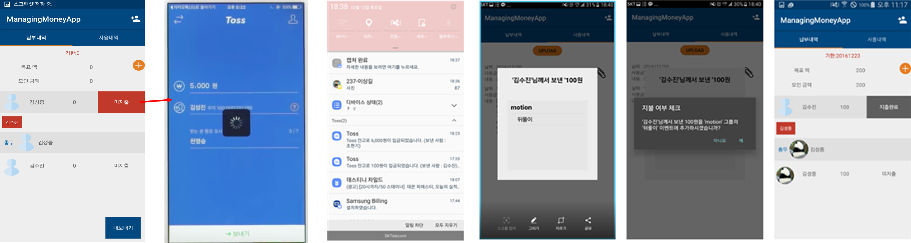
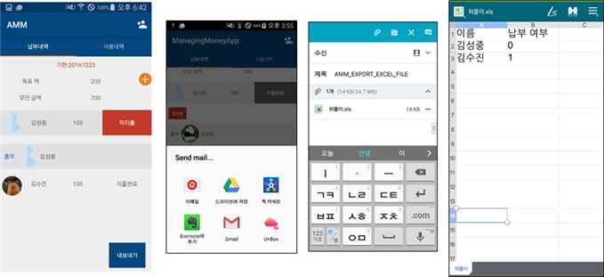

# Money-Manager-android
This app is auto money management apps for android 

## About 
모임이나 동호회, 동아리와 같은 단체 돈 관리가 필요한 곳에서 총무가 손쉽게 회원들의 지출 내역과 회비 사용내역을 관리하고, 회원들은 간편한 송금 시스템을 통해 회비를 쉽게 제출 할 수 있는 기능을 제공하는 돈 관리 어플리케이션입니다. 

## Features
* 회원가입 및 정보 저장
* 단체 모임을 위한 그룹 개설
* 그룹 내에서 정산할 수 있는 방을 event 형식으로 등록
* 입금 여부를 통해 자동으로 명단 체크
* TOSS API를 사용하여 TOSS 앱으로 이동, 없다면 앱 내에서 결제 가능
* 납부 여부를 포함한 총 명단리스트를 파일로 내보내기
* 회비의 사용 내역을 출금SMS 또는 영수증 사진을 통해 리스트화
* 지출 기한 종료 시 미 지출 인원에 대해서 알림기능

## Demo

 

 <b> Toss로 지불 </b> 
  
  

   

 <b> Excel로 내보내기 </b>  
  
  
## Usage
* Toss API
~~~
public class PaymentFragment extends Fragment {
    .,.
    //Toss TEST API Key
    private static final String API_KEY = "sk_test_apikey1234567890a";
~~~
현재 Toss API는 Test용을 사용하고 있으며, [이 곳](http://tossdev.github.io)을 통해 발급 받으실 수 있습니다.

Icon made from www.flaticon.com 
